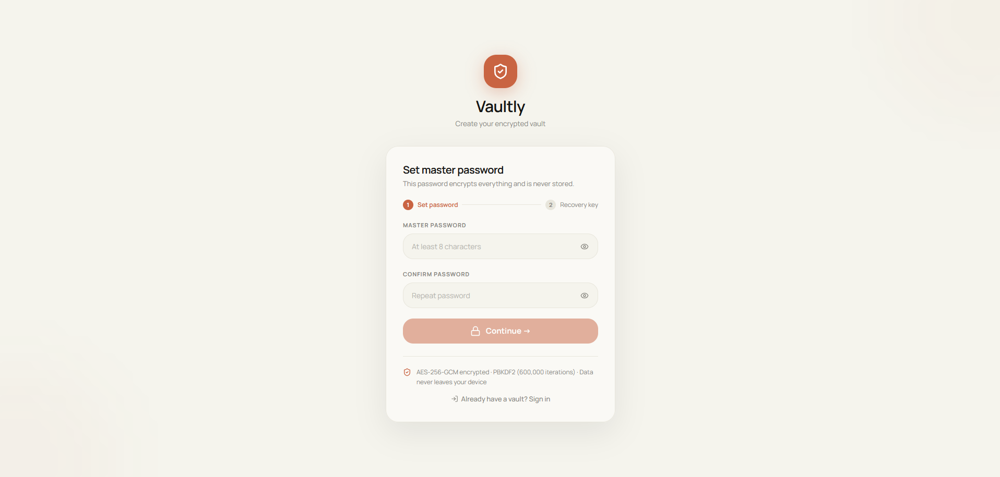
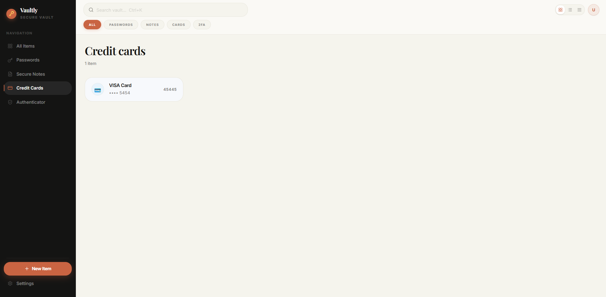
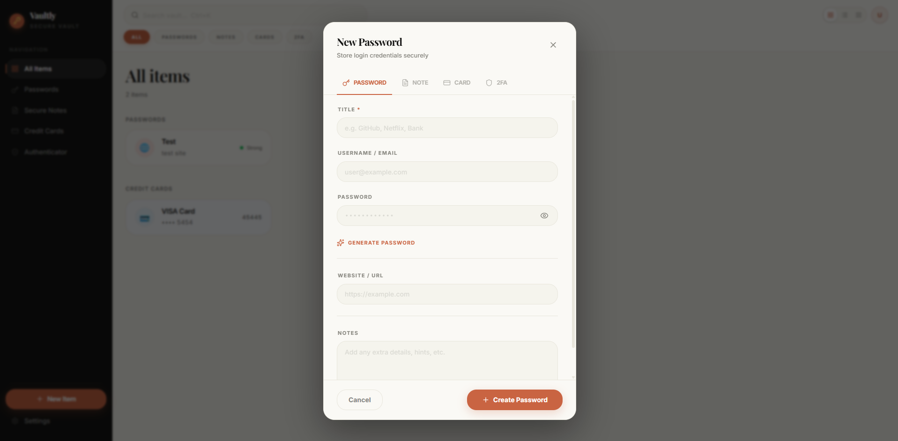
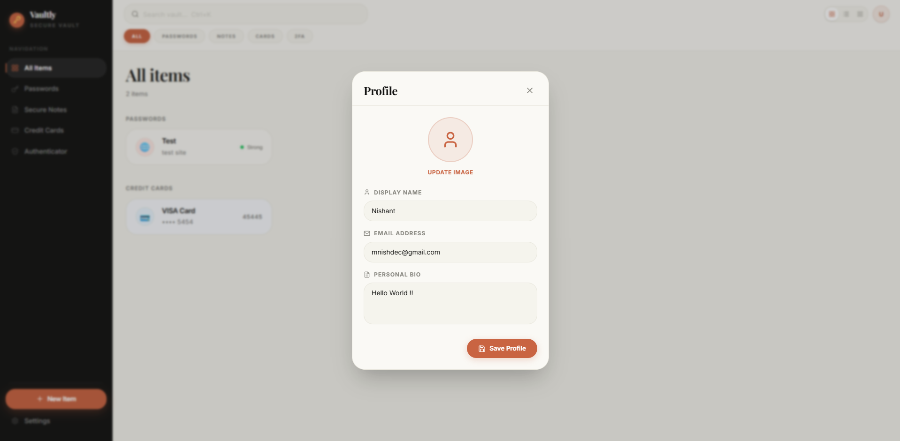

# Vaultly — Local Password Manager

<p align="center">
  
</p>

<p align="center">
  <em>Clean, local-first password manager focused on privacy and simplicity.</em>
</p>

---

## Overview
Vaultly is a privacy-centric password management solution designed with a local-first philosophy. Unlike cloud-dependent services, Vaultly operates entirely within your local environment, ensuring that sensitive credentials never leave your machine. The project focuses on providing a clean, distraction-free interface for secure data management.

## Screenshots

<p align="center">
  <strong>Main Dashboard & Items</strong>
</p>
<p align="center">
  
</p>

<p align="center">
  <strong>Secure Item Creation</strong>
</p>
<p align="center">
  
</p>

<p align="center">
  <strong>Profile & Customization</strong>
</p>
<p align="center">
  
</p>

---

## Current Features
- **Password Storage**: Organized management of login credentials.
- **Secure Notes**: Encrypted space for sensitive text information.
- **Credit Cards**: Structured storage for payment card details.
- **2FA / Authenticator**: Support for Time-based One-Time Passwords (TOTP).
- **Settings System**: Modular configuration for security and UI preferences.
- **Local Storage Handling**: Robust persistence using browser-based storage APIs.
- **Basic UI System**: A foundational design system built for clarity and ease of use.

## Work In Progress 🚧
Vaultly is under active development, and some areas are currently being refined:
- Certain settings buttons are not yet fully functional.
- UI spacing and typography systems are undergoing iterative refinement.
- Notification and toast feedback systems require further improvement.
- The profile and user management system is in a basic state.
- Some interface interactions lack final polish and smooth transitions.

## Planned Features / Roadmap
- **Browser Extension**: Dedicated extensions for Google Chrome and Microsoft Edge.
- **Windows Desktop App**: A standalone desktop application for improved system integration.
- **Enhanced Encryption**: Ongoing audits and improvements to data encryption handling.
- **Password Generator**: A more robust and customizable tool for creating strong passwords.
- **Sync Protocol**: Future consideration for optional, privacy-respecting synchronization.
- **UI Consistency**: Standardizing components across all views for a more cohesive experience.
- **Performance Optimization**: Reducing latency and improving responsiveness.

## Tech Stack
- **Framework**: React / Vite
- **Styling**: Tailwind CSS
- **Language**: TypeScript
- **State Management**: Local storage with a custom reactive state system.
- **Architecture**: Component-based UI for modularity and scalability.

## Running Locally

To get started with Vaultly in your local development environment:

```bash
# Install dependencies
npm install

# Start the development server
npm run dev
```
